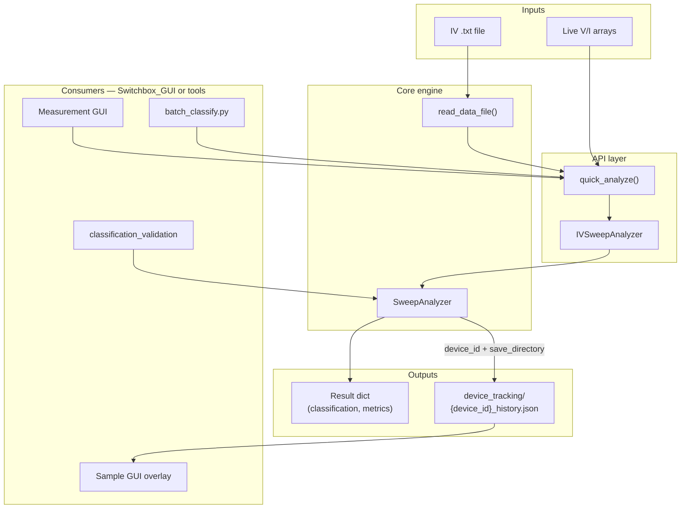

# Architecture

## Pipeline overview



## Module layers

```
analysis/
├── core/sweep_analyzer.py     # One sweep: metrics + classification + tracking write
├── api/iv_sweep_analyzer.py     # quick_analyze, analyze_sweep, IVSweepAnalyzer
├── api/iv_sweep_llm_analyzer.py # Optional LLM layer (not required)
├── aggregators/               # Sample/section orchestration (needs plotting in full app)
└── utils/                     # Folder migration helpers

tools/
├── data_consolidation/        # Dataset flatten + batch classify + review
└── classification_validation/ # Label sweeps, tune weights, measure accuracy
```

### Core (`analysis/core/sweep_analyzer.py`)

- **Class:** `SweepAnalyzer`
- **Responsibilities:**
  - Parse voltage/current (and optional time)
  - Split forward/backward loops
  - Compute resistance metrics (Ron, Roff, switching ratio)
  - Run `_classify_device()` when `analysis_level` is not `basic`
  - Compute memristivity score and confidence
  - Append measurement to device tracking JSON when `device_id` and `save_directory` are set

No imports from GUI or hardware — safe to run standalone from this repo.

### API (`analysis/api/iv_sweep_analyzer.py`)

- **`quick_analyze(voltage, current, time=None, **kwargs)`** — most common entry point
- **`analyze_sweep(...)`** — file path or arrays
- **`IVSweepAnalyzer`** — class wrapper for repeated analysis

### Aggregators (`analysis/aggregators/`)

Multi-device and full-sample orchestration. These depend on the `plotting` package in Switchbox_GUI and are **not required** for single-sweep classification. Included in the snapshot for reference.

## Live measurement flow (Switchbox_GUI)

After each sweep in Measurement GUI:

1. `quick_analyze(..., analysis_level='classification', device_id=..., save_directory=...)`
2. Write `classification_log.txt` in device folder (GUI-side)
3. Refresh Sample GUI map overlay from tracking JSON
4. Always save IV dashboard PNG
5. If **Extended** checkbox is on: analysis report `.txt`, stats panel

## Offline batch flow (this repo)

1. `consolidate.py` — copy `.txt` files into flat `tools/data_consolidation/data/`
2. `batch_classify.py` — run `quick_analyze` on each file
3. `launch_review.py` / `launch_flash_review.py` — manual correction
4. `review_corrections.json` — persisted overrides

## Device ID convention

Tracking files use:

```
{sample_name}_{section}_{device_number}
```

Example: `D94_A_1` for sample D94, section A, device 1.

This must match between Measurement GUI, tracking writer, and Sample GUI overlay lookup.

## Tracking directory resolution

Writers use:

```
{sample_save_dir}/sample_analysis/analysis/device_tracking/
```

Readers also check legacy paths:

- `{sample}/sample_analysis/device_tracking/`
- `{sample}/device_tracking/`

See `find_tracking_dir()` in Switchbox_GUI `yield_source.py` (logic mirrored in overlay docs).
