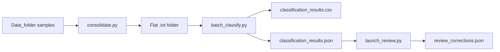

# Batch workflow

Offline classification of many sweeps without the measurement GUI.

## Overview



## Step 1 — Consolidate

Collect IV `.txt` files from sample folders into one flat directory.

```powershell
cd memristive-iv-classifier

# Preview
python tools/data_consolidation/consolidate.py --dry-run

# Copy (default source = OneDrive Data_folder if configured)
python tools/data_consolidation/consolidate.py

# Custom paths
python tools/data_consolidation/consolidate.py `
  --source "C:\Users\...\Documents\Data_folder" `
  --output tools/data_consolidation/data
```

**Included folders:** names starting with `D` + digits (e.g. `D94`, `D80-...`).

**Output naming:** `D94-A-1-{original_filename}.txt`

**Excluded:** `log.txt`, `classification_log.txt`, `*_analysis.txt`

Writes `manifest.csv` mapping output files to source paths.

## Step 2 — Batch classify

```powershell
python tools/data_consolidation/batch_classify.py
```

**Outputs** (in `tools/data_consolidation/`):

- `classification_results.csv` — open in Excel; sort by `review_priority`, `confidence`
- `classification_results.json` — full results for review GUI
- `classification_summary.txt` — type distribution stats
- `device_yield_summary.json` — per-device yield tiers

Uses `analysis_level='classification'` for speed.

## Step 3 — Review

**Flash review (fast Y/N):**

```powershell
python tools/data_consolidation/launch_flash_review.py
```

**Full review GUI:**

```powershell
python tools/data_consolidation/launch_review.py
```

Corrections saved to `review_corrections.json` and survive re-runs of batch classify.

## Step 4 — Validation / tuning (optional)

For systematic weight tuning against labeled data:

```powershell
python tools/classification_validation/launch_gui.py
```

See `tools/classification_validation/README.md` in this repo.

## Tips

- Run consolidate with `--dry-run` first to check file counts
- Start review with flash mode for high-volume datasets
- Re-sync from Switchbox_GUI before batch runs if classifier logic changed (see [SYNC_WITH_SWITCHBOX.md](SYNC_WITH_SWITCHBOX.md))

## Paths module

`tools/data_consolidation/paths.py` defines default Data_folder locations (OneDrive / Nottingham paths). Override with CLI flags if your data lives elsewhere.
