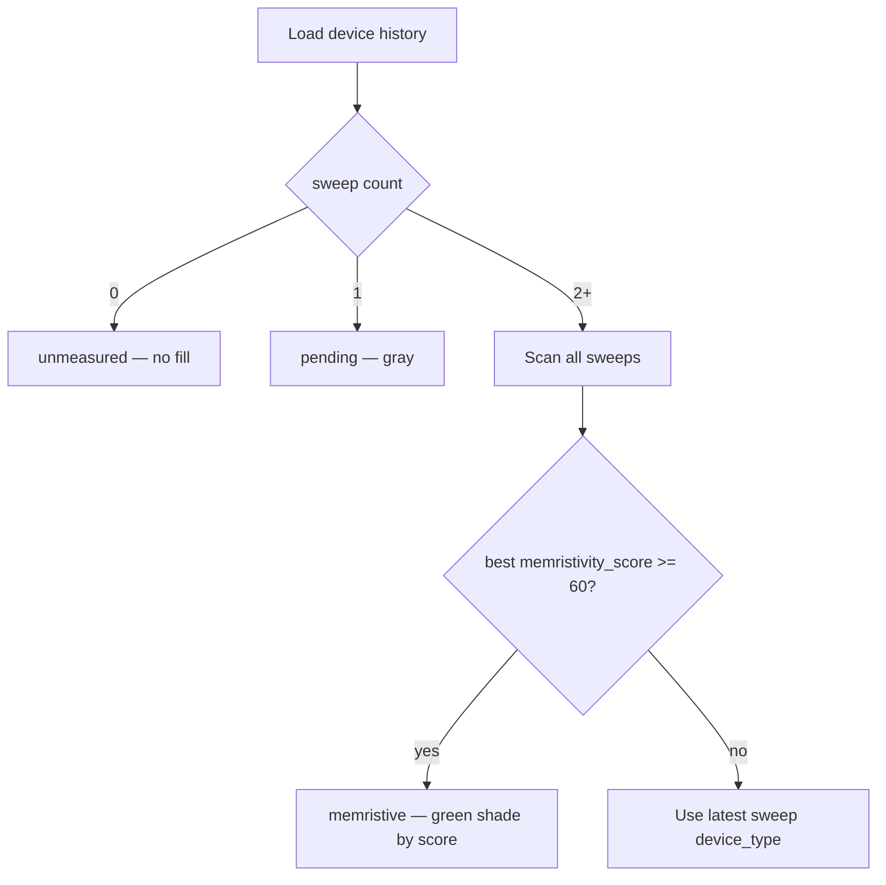

# Sample GUI overlay rules

These rules apply to the **device map color overlay** in Switchbox_GUI Sample GUI. They read persisted tracking JSON — they do not re-run classification.

Implementation: `Switchbox_GUI/gui/sample_gui/classification_overlay.py`  
Summarization: `summarize_device_from_history()` in `yield_source.py`

## Data source

```
{sample_dir}/sample_analysis/analysis/device_tracking/{device_id}_history.json
```

Device ID format: `{sample_folder_name}_{section}_{number}` (e.g. `D94_A_1`).

## Display status decision tree



## Colors (map fill)

| Status | Condition | Color |
|--------|-----------|-------|
| unmeasured | No file / empty measurements | No fill |
| pending | Exactly 1 sweep | `#BDBDBD` gray |
| memristive | ≥ 2 sweeps AND best score ≥ 60 | Green gradient `#A5D6A7` → `#66BB6A` by score |
| non_conductive | ≥ 2 sweeps, latest type | `#EF9A9A` red |
| ohmic | latest type | `#90CAF9` blue |
| rectifying | latest type | `#FFCC80` amber |
| uncertain | latest type | `#CE93D8` purple |
| capacitive / conductive | latest type | `#FFF176` / `#BCAAA4` |

## Score labels on map

When **Scores** toggle is on:

- Memristive: show **best** score (e.g. `72`)
- Pending (1 sweep): show score with `?` if available (e.g. `45?`) or `1`

## Summary strip counts

| Stat | Rule |
|------|------|
| Measured | `sweep_count ≥ 1` |
| Memristive | `display_status == memristive` |
| Promising | rectifying / memcapacitive latest type OR score 40–59 |
| Pending | exactly 1 sweep |

## Refresh triggers

- Sample selected in Sample GUI
- After each live measurement (Measurement GUI notifies overlay)
- Manual **Refresh** button on device map bar

## Separate from quick-scan status

Quick scan uses `device_status.json` (working/broken by resistance threshold). IV overlay uses tracking history only. Manual Excel yield override is not applied in v1 overlay.
